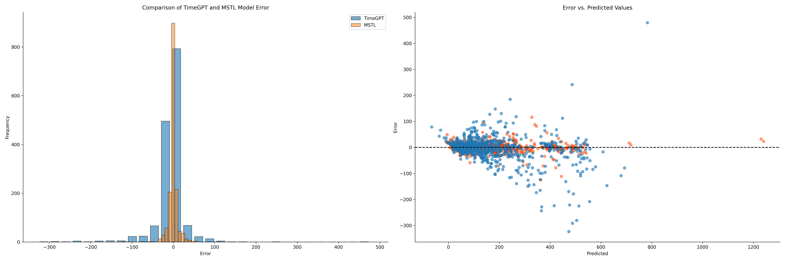

# Supply Chain Analytics and Demand Forecasting

## Project Overview
This project is divided into two main parts: Supply Chain Analytics and Demand Forecasting. The objective is to leverage advanced analytics and forecasting models to provide insights for better decision-making in supply chain management. Specifically, the demand forecasting part aims to forecast demand for the upcoming month.

## Business Understanding
Effective demand forecasting is crucial for maintaining optimal inventory levels, reducing stockouts, and minimizing excess inventory. This project addresses the business problem of predicting weekly sales units for various store-SKU combinations, which helps in making informed decisions regarding inventory management and promotional planning.

## Modeling and Evaluation
The following models were used for demand forecasting:
1. MSTL (Multiple Seasonal-Trend decomposition using Loess) is a statistical model for decomposing time series data into its trend, seasonal, and residual components.
2. TimeGPT, a generative pre-trained transformer model for time series forecasting.

**Evaluation Metrics**:
- Mean Absolute Error (MAE)
- Symmetric Mean Absolute Percentage Error (SMAPE)
### Model Comparison

- The MSTL model generally provides more accurate and robust predictions compared to the TimeGPT model, as evidenced by the
tighter distribution of error around zero and fewer extreme errors.

## Conclusion
The demand forecasting model developed in this project provides valuable insights into future product demand, enabling retail managers to make informed inventory decisions. The model's predictions help in reducing both stockouts and overstock situations, ultimately leading to cost savings and improved customer satisfaction. Future steps include incorporating additional features such as promotional events and competitor pricing to further enhance the model's accuracy and applicability.

[Here is the full code in PDF format.](SC_report.pdf)

## Tableau Dashboard
Explore the interactive Tableau dashboard for further insights: [Sales & Customer Dashboard](https://public.tableau.com/views/SalesCustomerDashboard_17196652819050/SalesOverview?:language=en-US&:sid=&:display_count=n&:origin=viz_share_link)
